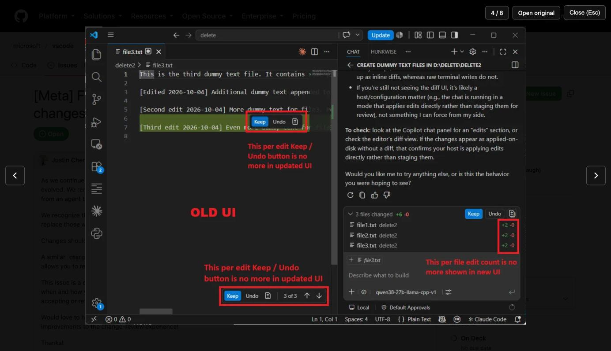
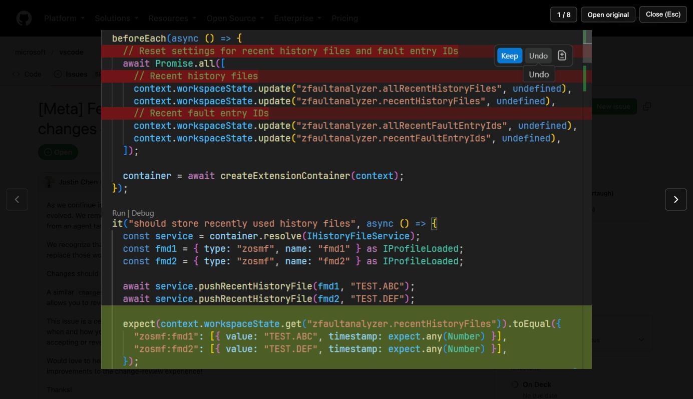

# GitHub Image Lightbox

A browser extension for Firefox and Chrome that opens GitHub image attachments
in a fullscreen overlay on top of the page, instead of navigating away to the
raw image.

Clicking a screenshot in an issue, pull request, discussion or comment normally
replaces the GitHub page with the bare image. With this extension the image
opens in a lightbox and GitHub stays right where you left it.



Arrow keys move between all attachments on the page, so screenshots from
different comments can be compared without leaving the thread.



## Features

- Click an attachment to open it fullscreen. Click the image to toggle between
  fit-to-screen and 100% size.
- Left/Right arrow keys, or the on-screen arrows, move between all image
  attachments on the page (description and every comment, in page order). This
  makes it easy to compare screenshots posted in different comments. A counter
  shows the position.
- Esc, the Close button, or a click on the dark backdrop closes the overlay.
- "Open original" opens the raw image in a new tab, like GitHub does by default.
- Cmd/Ctrl/Shift/middle clicks are left untouched, so the browser's own
  open-in-new-tab behaviour still works.
- No permissions, no network requests, no tracking. It is a single content
  script that runs on `github.com`.

## Install

### Firefox, from a release (recommended)

1. Download the latest `.xpi` from the
   [Releases](https://github.com/PauloSankovic/github-image-lightbox/releases/latest) page.
2. Open the downloaded file in Firefox (drag it into a Firefox window or open it
   via `File > Open File`).
3. Confirm the "Add" prompt.

The file is signed by Mozilla through the self-distribution channel, so it
installs in regular Firefox and survives restarts.

### Firefox, temporary from source

Useful for trying it out or for development. The extension is removed when
Firefox restarts.

1. Clone this repository.
2. Open `about:debugging#/runtime/this-firefox` in Firefox.
3. Click "Load Temporary Add-on..." and select the `manifest.json` file.

Requires Firefox 140 or newer.

### Chrome, from source

Chrome only installs packaged extensions through the Chrome Web Store, so
install it unpacked from a clone. Unlike Firefox, this persists across
restarts.

1. Clone this repository.
2. Open `chrome://extensions`, enable "Developer mode" (top right).
3. Click "Load unpacked" and select the repository folder.

Chrome may show a warning about the unrecognized `browser_specific_settings`
manifest key. It is Firefox-only metadata and can be ignored.

## Development

```sh
npx web-ext lint
npx web-ext run --start-url https://github.com/microsoft/vscode/issues/339363
npx web-ext build
```

`web-ext run` launches a separate Firefox profile with the extension loaded and
reloads it whenever a file changes.

## Releasing

Releases are built by GitHub Actions. Bump `version` in `manifest.json`, commit,
then push a matching tag:

```sh
git tag v1.3.0
git push origin main v1.3.0
```

The workflow lints the extension, signs it through Mozilla's self-distribution
channel and attaches the signed `.xpi` to a new GitHub release. It needs the
`AMO_JWT_ISSUER` and `AMO_JWT_SECRET` repository secrets, created from
https://addons.mozilla.org/developers/addon/api/key/.

## License

[MIT](LICENSE)
